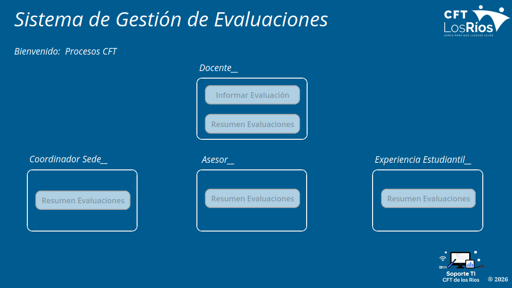
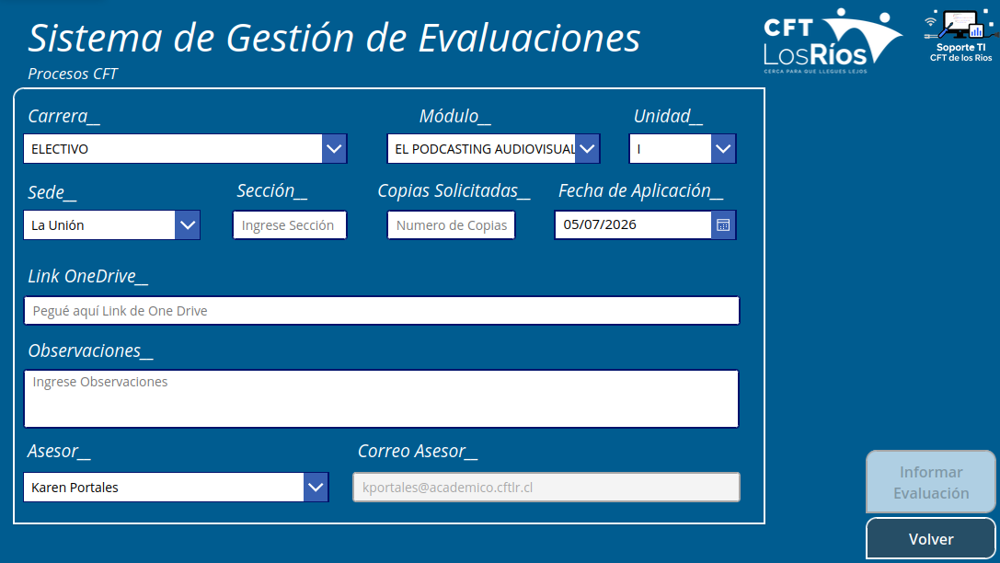
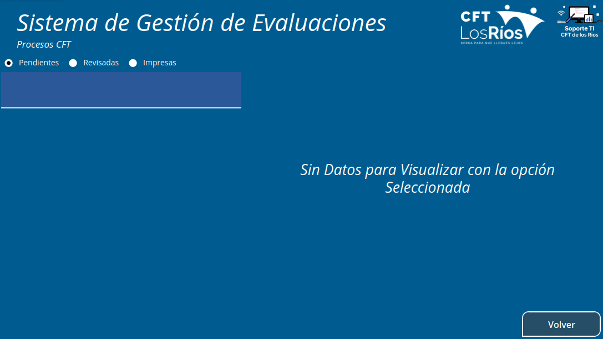

# Sistema de Gestión de Evaluaciones Académicas (Power Platform + Power BI)

## 📋 Descripción del Proyecto
Este ecosistema digital fue desarrollado para optimizar, estandarizar y trazar el ciclo de vida completo de las evaluaciones académicas dentro de la institución. Permite la colaboración en tiempo real de 4 roles clave (Docentes, Asesores de Carrera, Experiencia Estudiantil y Coordinadores de Sede), garantizando que cada instrumento evaluativo sea correctamente formulado, revisado, impreso y ejecutado.

### 🎯 Impacto Estratégico
Más allá de la automatización operativa, el sistema centraliza registros estructurados en SharePoint que alimentan dashboards en Power BI. Esto permite al área de Docencia auditar la calidad del proceso y **responder de manera ágil y con datos fehacientes a los requerimientos de la CNED de cara al proceso de Acreditación Institucional**.

---

## 🛠️ Stack Tecnológico
*   **Power Apps:** Aplicación Canvas multiperfil con seguridad basada en roles para la interacción de los usuarios.
*   **SharePoint Online:** Motor de almacenamiento y base de datos relacional para el registro de cada etapa.
*   **Power Automate:** Flujos de aprobación automatizados, alertas dinámicas por correo electrónico y gestión de estados del ciclo de vida.
*   **Power BI:** Dashboard analítico para la visualización en tiempo real de métricas clave, cuellos de botella y cobertura evaluativa.

---

## 🔄 El Flujo del Proceso
1.  **Docente:** Sube el instrumento de evaluación (vía enlace OneDrive institucional) e informa los metadatos correspondientes (Carrera, Módulo, Unidad, Sede, Copias, etc.).
2.  **Asesor de Carrera:** Recibe una alerta automática. Revisa la evaluación y determina:
    *   **Aprobar:** El flujo avanza a la siguiente etapa.
    *   **Observar:** La evaluación se devuelve automáticamente al Docente con comentarios para su modificación.
3.  **Experiencia Estudiantil:** Recibe la notificación de evaluaciones aprobadas, gestiona la impresión masiva según las copias solicitadas e informa el cierre de la tarea.
4.  **Coordinador de Sede (Supervisor):** Cuenta con visibilidad completa de los estados de cada evaluación en tiempo real, pudiendo enviar recordatorios automáticos a los actores pendientes.

---

## 📸 Arquitectura y Pantallazos
*   **Menú Principal (Seguridad por Rol):** 
*   **Formulario de Ingreso (Docente):** 
*   **Módulo de Aprobaciones (Asesor):** 

---

## 🚀 Próximas Mejoras (Roadmap)
*   [ ] **Integración Nativa de Archivos:** Reemplazar el pegado manual de links de OneDrive por un control de adjuntos directo a SharePoint.
*   [ ] **Notificaciones Omnicanal:** Incorporar Tarjetas Adaptativas (Adaptive Cards) en Microsoft Teams para aprobaciones rápidas.
*   [ ] **Historial de Versiones:** Trazabilidad interna de comentarios de observaciones entre Docente y Asesor.
